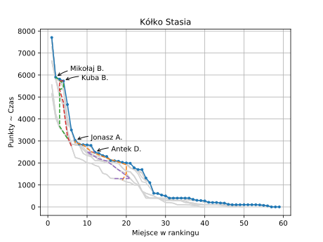

SIO2 Watcher
===

Simple program to look for changes in SIO2's ranking and plot changes of everyone's scores over time.
Names are semi-anonymized by trimming surnames to one letter, to keep everyone's privacy safe.

One day I just had a *vision* how to display all this data. I quickly threw together `plotter.py` and it produced this amazing plot:

